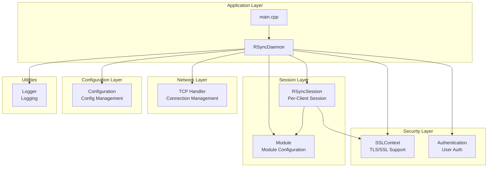
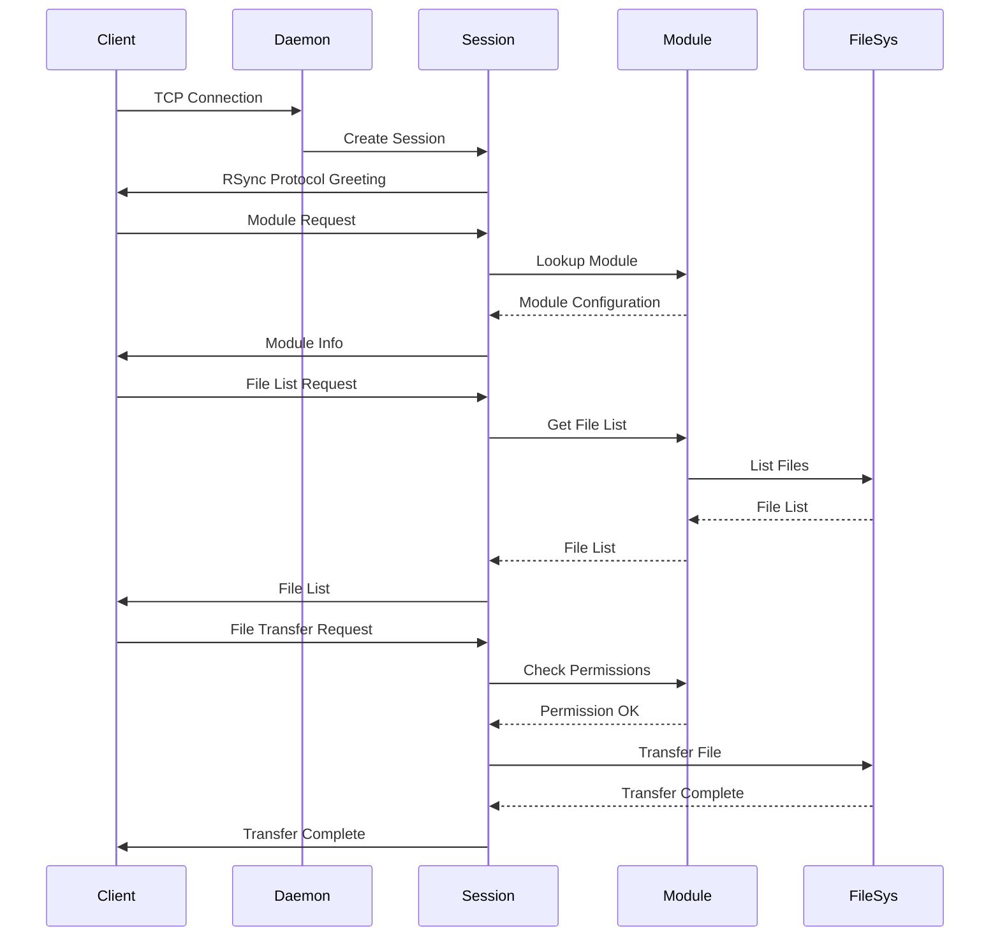

# Simple RSync Daemon - Architecture Diagrams

## System Architecture

```mermaid
graph TB
    subgraph "Application Layer"
        Main[main.cpp]
        Daemon[RSyncDaemon]
    end
    
    subgraph "Session Layer"
        Session[RSyncSession<br/>Per-Client Session]
        Module[Module<br/>Module Configuration]
    end
    
    subgraph "Network Layer"
        TCPHandler[TCP Handler<br/>Connection Management]
    end
    
    subgraph "Security Layer"
        SSLContext[SSLContext<br/>TLS/SSL Support]
        Auth[Authentication<br/>User Auth]
    end
    
    subgraph "Configuration Layer"
        Config[Configuration<br/>Config Management]
    end
    
    subgraph "Utilities"
        Logger[Logger<br/>Logging]
    end
    
    Main --> Daemon
    Daemon --> Session
    Daemon --> Module
    Daemon --> TCPHandler
    Daemon --> SSLContext
    Daemon --> Auth
    Daemon --> Config
    Daemon --> Logger
    
    Session --> Module
    Session --> SSLContext
```

## RSync Session Flow

```mermaid
sequenceDiagram
    participant Client
    participant Daemon
    participant Session
    participant Module
    participant FileSys
    
    Client->>Daemon: TCP Connection
    Daemon->>Session: Create Session
    Session->>Client: RSync Protocol Greeting
    
    Client->>Session: Module Request
    Session->>Module: Lookup Module
    Module-->>Session: Module Configuration
    Session->>Client: Module Info
    
    Client->>Session: File List Request
    Session->>Module: Get File List
    Module->>FileSys: List Files
    FileSys-->>Module: File List
    Module-->>Session: File List
    Session->>Client: File List
    
    Client->>Session: File Transfer Request
    Session->>Module: Check Permissions
    Module-->>Session: Permission OK
    Session->>FileSys: Transfer File
    FileSys-->>Session: Transfer Complete
    Session->>Client: Transfer Complete
```

