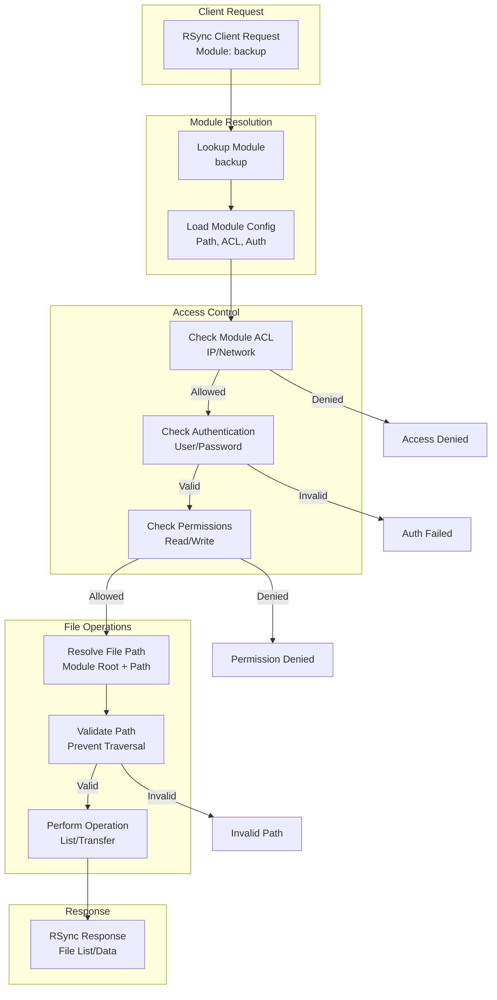

# Simple RSync Daemon - Data Flow Diagrams

## RSync Protocol Data Flow

```mermaid
flowchart LR
    subgraph "Client"
        C1[RSync Client]
    end

    subgraph "Network"
        N1[TCP Connection<br/>Port 873]
    end

    subgraph "Server Input"
        S1[TCP Socket<br/>Accept Connection]
        S2[Raw Bytes]
    end

    subgraph "Protocol Parsing"
        P1[Protocol Parser<br/>Parse RSync Protocol]
        P2[Parsed Command<br/>Command, Module, Args]
    end

    subgraph "Module Resolution"
        MR1[Module Resolver<br/>Find Module]
        MR2[Module Config<br/>Path, Permissions]
    end

    subgraph "File Transfer"
        FT1[File Transfer Handler<br/>Process Transfer]
        FT2[File System<br/>Read/Write Files]
    end

    subgraph "Server Output"
        O1[TCP Socket<br/>Send Response]
        O2[TCP Connection]
    end

    C1 -->|RSync Protocol| N1
    N1 --> S1
    S1 --> S2
    S2 --> P1
    P1 --> P2
    P2 --> MR1
    MR1 --> MR2
    MR2 --> FT1
    FT1 --> FT2
    FT2 --> O1
    O1 --> O2
    O2 -->|RSync Response| C1
```

## Module-Based File Transfer Flow

```mermaid
flowchart TB
    subgraph "Client Request"
        CR1[RSync Client Request<br/>Module: backup]
    end

    subgraph "Module Resolution"
        MR1[Lookup Module<br/>backup]
        MR2[Load Module Config<br/>Path, ACL, Auth]
    end

    subgraph "Access Control"
        AC1[Check Module ACL<br/>IP/Network]
        AC2[Check Authentication<br/>User/Password]
        AC3[Check Permissions<br/>Read/Write]
    end

    subgraph "File Operations"
        FO1[Resolve File Path<br/>Module Root + Path]
        FO2[Validate Path<br/>Prevent Traversal]
        FO3[Perform Operation<br/>List/Transfer]
    end

    subgraph "Response"
        RESP1[RSync Response<br/>File List/Data]
    end

    CR1 --> MR1
    MR1 --> MR2
    MR2 --> AC1
    AC1 -->|Allowed| AC2
    AC1 -->|Denied| RESP2[Access Denied]
    AC2 -->|Valid| AC3
    AC2 -->|Invalid| RESP3[Auth Failed]
    AC3 -->|Allowed| FO1
    AC3 -->|Denied| RESP4[Permission Denied]
    FO1 --> FO2
    FO2 -->|Valid| FO3
    FO2 -->|Invalid| RESP5[Invalid Path]
    FO3 --> RESP1
```
