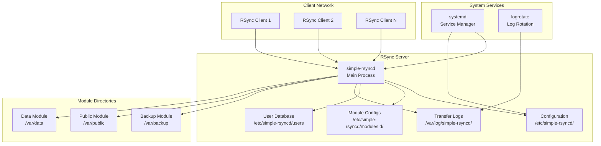
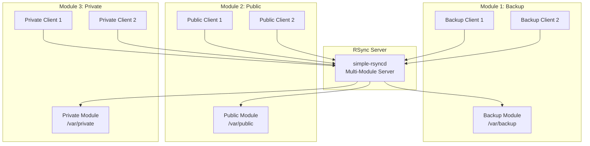

# Simple RSync Daemon - Deployment Diagrams

## Basic Deployment Architecture

```mermaid
graph TB
    subgraph "Client Network"
        Client1[RSync Client 1]
        Client2[RSync Client 2]
        ClientN[RSync Client N]
    end

    subgraph "RSync Server"
        Server[simple-rsyncd<br/>Main Process]
        Config[Configuration<br/>/etc/simple-rsyncd/]
        Modules[Module Configs<br/>/etc/simple-rsyncd/modules.d/]
        UserDB[User Database<br/>/etc/simple-rsyncd/users]
        Logs[Transfer Logs<br/>/var/log/simple-rsyncd/]
    end

    subgraph "Module Directories"
        Module1[Backup Module<br/>/var/backup]
        Module2[Public Module<br/>/var/public]
        ModuleN[Data Module<br/>/var/data]
    end

    subgraph "System Services"
        Systemd[systemd<br/>Service Manager]
        Logrotate[logrotate<br/>Log Rotation]
    end

    Client1 --> Server
    Client2 --> Server
    ClientN --> Server

    Systemd --> Server
    Systemd --> Config

    Server --> Config
    Server --> Modules
    Server --> UserDB
    Server --> Logs

    Server --> Module1
    Server --> Module2
    Server --> ModuleN

    Logrotate --> Logs
```

## Module-Based Deployment

```mermaid
graph TB
    subgraph "RSync Server"
        Server[simple-rsyncd<br/>Multi-Module Server]
    end

    subgraph "Module 1: Backup"
        Module1[Backup Module<br/>/var/backup]
        Client1_1[Backup Client 1]
        Client1_2[Backup Client 2]
    end

    subgraph "Module 2: Public"
        Module2[Public Module<br/>/var/public]
        Client2_1[Public Client 1]
        Client2_2[Public Client 2]
    end

    subgraph "Module 3: Private"
        Module3[Private Module<br/>/var/private]
        Client3_1[Private Client 1]
        Client3_2[Private Client 2]
    end

    Client1_1 --> Server
    Client1_2 --> Server
    Client2_1 --> Server
    Client2_2 --> Server
    Client3_1 --> Server
    Client3_2 --> Server

    Server --> Module1
    Server --> Module2
    Server --> Module3
```
