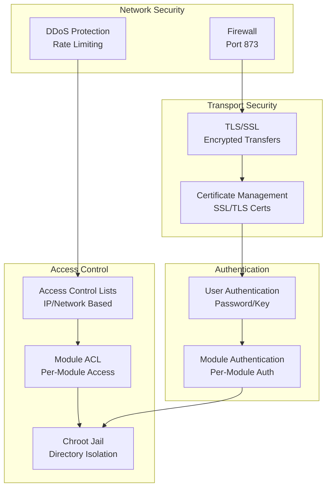
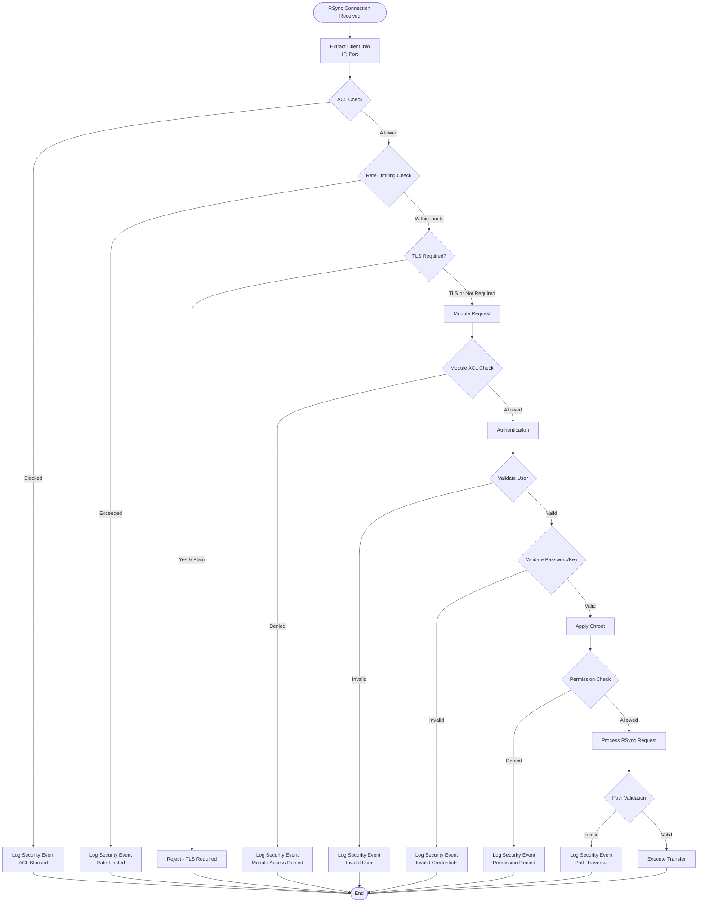

# Simple RSync Daemon - Security Diagrams

## Security Architecture

```mermaid
graph TB
    subgraph "Network Security"
        Firewall[Firewall<br/>Port 873]
        DDoSProtection[DDoS Protection<br/>Rate Limiting]
    end

    subgraph "Transport Security"
        TLS[TLS/SSL<br/>Encrypted Transfers]
        Certificate[Certificate Management<br/>SSL/TLS Certs]
    end

    subgraph "Access Control"
        ACL[Access Control Lists<br/>IP/Network Based]
        ModuleACL[Module ACL<br/>Per-Module Access]
        Chroot[Chroot Jail<br/>Directory Isolation]
    end

    subgraph "Authentication"
        UserAuth[User Authentication<br/>Password/Key]
        ModuleAuth[Module Authentication<br/>Per-Module Auth]
    end

    Firewall --> TLS
    DDoSProtection --> ACL

    TLS --> Certificate
    Certificate --> UserAuth

    ACL --> ModuleACL
    ModuleACL --> Chroot

    UserAuth --> ModuleAuth
    ModuleAuth --> Chroot
```

## Security Flow

```mermaid
flowchart TD
    Start([RSync Connection Received]) --> ExtractInfo[Extract Client Info<br/>IP, Port]

    ExtractInfo --> ACLCheck{ACL Check}
    ACLCheck -->|Blocked| LogBlock1[Log Security Event<br/>ACL Blocked]
    ACLCheck -->|Allowed| RateLimitCheck

    RateLimitCheck{Rate Limiting Check}
    RateLimitCheck -->|Exceeded| LogBlock2[Log Security Event<br/>Rate Limited]
    RateLimitCheck -->|Within Limits| TLSCheck

    TLSCheck{TLS Required?}
    TLSCheck -->|Yes & Plain| RejectTLS[Reject - TLS Required]
    TLSCheck -->|TLS or Not Required| ModuleCheck

    ModuleCheck[Module Request] --> ModuleACLCheck{Module ACL Check}
    ModuleACLCheck -->|Denied| LogBlock3[Log Security Event<br/>Module Access Denied]
    ModuleACLCheck -->|Allowed| AuthCheck

    AuthCheck[Authentication] --> ValidateUser{Validate User}
    ValidateUser -->|Invalid| LogBlock4[Log Security Event<br/>Invalid User]
    ValidateUser -->|Valid| ValidatePass{Validate Password/Key}

    ValidatePass -->|Invalid| LogBlock5[Log Security Event<br/>Invalid Credentials]
    ValidatePass -->|Valid| ChrootCheck

    ChrootCheck[Apply Chroot] --> PermissionCheck{Permission Check}
    PermissionCheck -->|Denied| LogBlock6[Log Security Event<br/>Permission Denied]
    PermissionCheck -->|Allowed| ProcessRequest

    ProcessRequest[Process RSync Request] --> PathValidation{Path Validation}
    PathValidation -->|Invalid| LogBlock7[Log Security Event<br/>Path Traversal]
    PathValidation -->|Valid| ExecuteTransfer

    ExecuteTransfer[Execute Transfer] --> End([End])

    LogBlock1 --> End
    LogBlock2 --> End
    LogBlock3 --> End
    LogBlock4 --> End
    LogBlock5 --> End
    LogBlock6 --> End
    LogBlock7 --> End
    RejectTLS --> End
```
